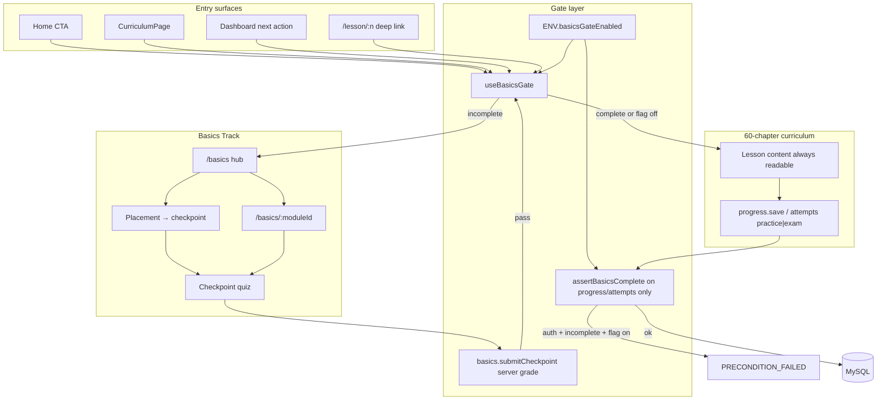
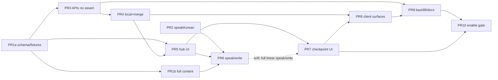

# EasyEPS — Foundational Korean Basics Track (Pre–Chapter 1)

| Field | Value |
|---|---|
| **Document** | Foundational Hangul Basics Track Design |
| **Author** | EasyEPS Engineering (draft) |
| **Date** | 2026-07-17 |
| **Status** | Draft (rev 3 — round-2 review fixes) |
| **Codebase** | `/home/ubuntu/EasyEPS` |
| **Related** | `IMPLEMENTATION_PLAN.md`, `content/SCHEMA.md`, `shared/lesson.ts`, `client/src/pages/LessonPage.tsx` |

---

## Overview

Bangla-speaking EPS-TOPIK beginners often open **Chapter 1 (자기소개 / Self Introduction)** without being able to read Hangul. Today the product has no literacy foundation: Curriculum lists all 60 chapters as immediately startable, Home CTAs deep-link to `/lesson/1`, and lesson content assumes Hangul literacy from the first vocabulary card.

This design introduces a **Foundational Basics Track** (“Basics”) that sits **before** the 60-chapter curriculum. Learners complete a short, content-driven sequence—alphabet (jamo), speaking (listen & repeat), writing (stroke/trace), syllable building, and a light batchim intro—then pass a **server-graded** capstone checkpoint. Only then unlock Chapter 1 progress for signed-in users (and local chapter progress for guests).

Basics matches EasyEPS visual language (SiteShell, paper-card, cream / navy / gold, serif headlines, trilingual `bn` default / `ko` / `en`) and existing dual-progress patterns (guest `localStorage` + signed-in Drizzle/tRPC). Content lives under `content/basics/` with its own Zod schema—not the 60-lesson schema.

**Security principle:** module step progress may be client-reported; **curriculum unlock (`basicsProgress.completed`) is set only by server-side grading of checkpoint answers** (or trusted legacy grandfather / admin bypass / feature-flag off).

---

## Background & Motivation

### Current state

| Area | Today |
|---|---|
| Entry path | Landing → Curriculum → Lesson N (1–60) immediately |
| Content source | `content/lessons/lesson-01.json` … `lesson-60.json` via `server/content.ts` + Zod `lessonSchema` |
| Progress (guest) | `client/src/lib/localProgress.ts` key `easyeps-learning-v2` |
| Progress (auth) | `lessonProgress` table + `progress.save` / `progress.list` / `progress.overview` |
| TTS | Browser `speechSynthesis` with `lang: "ko-KR"` in `LessonPage.tsx` and `MockTestPage.tsx` (duplicated; not shared) |
| Voice STT | `server/_core/voiceTranscription.ts` exists but is **not** wired into routers (unused for v1) |
| Hangul track | None |
| Gate | None—any chapter URL works |
| Env config | `server/_core/env.ts` is a small static `ENV` object (no boolean feature flags yet) |
| Profile badges | Hardcoded client heuristics in `ProfilePage.tsx` (not solely DB-driven) |

### Pain points

1. **Literacy gap**: Chapter 1 vocabulary assumes Hangul reading.
2. **No progressive onboarding**: Home CTA → `/lesson/1` with no Hangul primer.
3. **Inconsistent learner outcomes**: Users can complete chapters without recognizing jamo.
4. **Product trust**: Bangla-first EPS prep must close the alphabet gap explicitly.

### Constraints

- Match existing UI; no parallel design system.
- Prefer content-driven JSON pack + schema.
- Voice: browser TTS accepted (`IMPLEMENTATION_PLAN.md`).
- Writing: client canvas/SVG stroke practice; no handwriting ML.
- Gate: client UX for everyone; **server enforcement for signed-in chapter progress/attempts**.
- Trilingual labels throughout.

---

## Goals & Non-Goals

### Goals

1. Ship a **Basics track** covering Hangul jamo, syllable assembly, batchim intro, listen-and-repeat speaking, and stroke/trace writing.
2. **Gate Chapter 1–60 progress** for signed-in users (and local chapter progress for guests) until Basics checkpoint is **server-passed** (or grandfathered / flag off).
3. Persist Basics progress for **guests (localStorage)** and **signed-in users (DB)**, with an explicit **login merge**.
4. Match design-system **visual patterns** and i18n; extract shared chrome only where it reduces duplication.
5. Keep content **authorable offline** under `content/basics/`.
6. Provide recoverable UX: resume mid-module, retry checkpoint, placement-test path for literate learners, optional review after unlock.

### Non-Goals

- Replacing or renumbering the 60 EPS chapters.
- Server-side TTS or pre-recorded audio files for v1.
- Handwriting recognition / ML stroke grading.
- Full Hangul advanced inventory beyond a beginner-safe subset.
- **Hard-gating mock tests** in v1 (soft banner only).
- **Hard-failing `curriculum.get` for signed-in users** (content remains readable; **writes** are gated). Guests remain local-gated only.
- Making Basics count toward the 60-lesson certificate (separate badge only).
- Full metrics/alerting pipeline beyond `console` + optional admin counter.

---

## Proposed Design

### High-level architecture



### Curriculum structure (Basics modules)

Basics is a track of **8 modules** (IDs stable for progress keys). Estimated total time: **90–150 minutes** (sessions may split).

| Order | Module ID | Title (en / bn / ko) | Skills | Primary activities | Completion (pure function inputs) |
|------:|---|---|---|---|---|
| 0 | `welcome` | Hangul Roadmap / হ্যাঙ্গুল পরিচিতি / 한글 안내 | Motivation, structure, romanization | Explain steps + quiz | All `requiredStepIds` in `stepsDone` + quiz ratio ≥ module `passRatio` |
| 1 | `consonants` | Basic Consonants / মৌলিক ব্যঞ্জনবর্ণ / 기본 자음 | 14 plain consonants | jamo-grid, speak, write, quiz | `stepsDone` ⊇ required; `speakItemsDone.length ≥ minSpeakItems`; `writeItemsDone.length ≥ minWriteItems`; quiz ratio ≥ passRatio |
| 2 | `vowels` | Basic Vowels / মৌলিক স্বরবর্ণ / 기본 모음 | 10 basic vowels | Same as consonants | Same shape with module-level minima from content |
| 3 | `syllables` | Building Syllables / অক্ষর গঠন / 음절 만들기 | CV composition | Syllable builder + quiz | Builder prompts done ≥ min + quiz ratio ≥ passRatio |
| 4 | `batchim` | Final Consonants Intro / ব্যাচিম পরিচিতি / 받침 입문 | Final consonants concept | Explain + quiz | Required steps + quiz ratio ≥ passRatio |
| 5 | `speak-lab` | Speak Lab / উচ্চারণ অনুশীলন / 발음 연습 | Listen & repeat | Speak items with minListens | Every speak item id in `speakItemsDone` (count-based, **not** “80% self-rate”) |
| 6 | `write-lab` | Write Lab / লেখা অনুশীলন / 쓰기 연습 | Stroke practice | StrokePractice per item | Every write item id in `writeItemsDone` (coverage or skip-after-fails) |
| 7 | `checkpoint` | Basics Check / বেসিক পরীক্ষা / 기초 확인 | Capstone | Mixed quiz | **Server:** `score/total >= passRatio` (default **0.7**) via `submitCheckpoint` only |

**Jamo inventory (v1):**

- **Consonants (14):** ㄱ ㄴ ㄷ ㄹ ㅁ ㅂ ㅅ ㅇ ㅈ ㅊ ㅋ ㅌ ㅍ ㅎ  
- **Vowels (10):** ㅏ ㅑ ㅓ ㅕ ㅗ ㅛ ㅜ ㅠ ㅡ ㅣ  
- **Batchim subset:** ㄱ ㄴ ㄷ ㄹ ㅁ ㅂ ㅇ  
- **Out of v1:** tensed doubles, complex vowels, advanced liaison.

#### In-track unlock + placement test

**Default path:** module `n` unlocks when module `n-1` is complete (via pure `isModuleComplete`). Hub shows all modules with lock icons. Review of completed modules always allowed.

**Placement / test-out (v1):** Hub offers **“আমি ইতিমধ্যে হ্যাঙ্গুল জানি” / I already know Hangul** → opens **checkpoint only** (module 7) without requiring modules 0–6. Rationale: literate learners should not burn 90+ minutes; drop-off risk of strict linear + write-lab is real. Passing checkpoint still unlocks curriculum. Failing returns learner to hub with recommended start at `welcome` or first incomplete module. Modules 0–6 remain available for study anytime after placement fail or for voluntary completion (badges/progress aesthetics only—not required if checkpoint already passed).

Once checkpoint is server-passed, `completed` is **sticky** until explicit Basics reset.

### Module completion model (shared pure functions)

Progress fields must support the pure functions—not vague booleans alone.

```ts
// shared/basics.ts

export type BasicsModuleProgress = {
  moduleId: string;
  stepsDone: string[];           // step ids marked viewed/finished
  speakItemsDone: string[];      // speak item ids that met minListens (or visual fallback)
  writeItemsDone: string[];      // write item ids that met coverage or skipAfterFailures
  builderItemsDone: string[];    // syllable-builder prompt ids correct
  quizScore?: number;            // raw count correct
  quizTotal?: number;            // raw count total
  lastStepId?: string;
  updatedAt: string;
  // NOTE: module-level `completed` is DENORMALIZED cache only; always recompute via isModuleComplete
  completed?: boolean;
};

export type BasicsProgress = {
  version: 1;
  modules: Record<string, BasicsModuleProgress>;
  /** Set only after trusted unlock (server submitCheckpoint / legacy / admin). Guests set after local scoreBasicsQuiz pass. */
  checkpointPassedAt?: string;
  unlockSource?: "checkpoint" | "legacy-migration" | "admin" | "flag-off";
};

/** Content-driven requirements (on module JSON root). */
export type ModuleRequirements = {
  requiredStepIds: string[];
  minSpeakItems: number;      // 0 if no speak step
  minWriteItems: number;      // 0 if no write step
  minBuilderItems: number;    // 0 if no builder
  passRatio: number;          // default 0.7; applied when module has a quiz step
};

export function quizRatio(p: BasicsModuleProgress): number | null {
  if (p.quizTotal == null || p.quizTotal <= 0 || p.quizScore == null) return null;
  return p.quizScore / p.quizTotal;
}

export function isModuleComplete(
  module: BasicsModule, // parsed content
  progress: BasicsModuleProgress | undefined,
): boolean {
  if (!progress) return false;
  const req = module.requirements;
  const stepsOk = req.requiredStepIds.every(id => progress.stepsDone.includes(id));
  const speakOk = progress.speakItemsDone.length >= req.minSpeakItems;
  const writeOk = progress.writeItemsDone.length >= req.minWriteItems;
  const builderOk = progress.builderItemsDone.length >= req.minBuilderItems;
  const hasQuiz = module.steps.some(s => s.type === "quiz");
  const quizOk = !hasQuiz || (quizRatio(progress) != null && quizRatio(progress)! >= req.passRatio);
  return stepsOk && speakOk && writeOk && builderOk && quizOk;
}

/** Curriculum unlock — NEVER use raw score >= 0.7 without total. */
export function isBasicsComplete(progress: BasicsProgress): boolean {
  return Boolean(progress.checkpointPassedAt);
}

export function isCheckpointPassing(score: number, total: number, passRatio = 0.7): boolean {
  return total > 0 && score / total >= passRatio;
}
```

**Content requirements examples:**

| Module | requirements (illustrative) |
|---|---|
| `welcome` | requiredStepIds: all explain ids; minSpeak/Write/Builder: 0; passRatio: 0.67 (2/3) |
| `consonants` | minSpeakItems: 11 (≥80% of 14 as **count**, not self-rate quality); minWriteItems: 6; passRatio: 0.7 |
| `speak-lab` | minSpeakItems: = count of speak items in content; others 0 |
| `write-lab` | minWriteItems: = count of write items; others 0 |
| `checkpoint` | N/A for `isModuleComplete` teaching path—unlock only via `submitCheckpoint` |

On every `saveProgress` patch, server (and client) **recomputes** `module.completed = isModuleComplete(content, mergedProgress)` and **rejects** any client field that sets track-level `checkpointPassedAt` / row `completed`.

### Gating model

#### What is locked

| Surface | Guest | Signed-in user | Admin |
|---|---|---|---|
| `/basics/*` | Always open | Always open | Open |
| `/lesson/:chapter` **UI** (chapter practice writes) | Local gate: lock card if Basics incomplete **and** `gateEnabled` | Same; short-circuit before local writes | Bypass |
| `curriculum.get` / `curriculum.list` | Allowed (full JSON) | **Allowed** (full JSON)—preview OK | Allowed |
| `progress.save` | N/A (local only; client suppresses when gated) | **Blocked** if gate active + incomplete | Bypass |
| `attempts.record` `practice` / `chapter-exam` | N/A | **Blocked** if gate active + incomplete (**before** `createAttempt`) | Bypass |
| `attempts.record` `mock-test` | Soft banner only | **Never blocked** in v1 | — |
| Mock test UI | Soft banner on `MockTestPage` | Soft banner | — |
| Certificate / 60-chapter badges | Unchanged | Unchanged | — |

**Rationale for not hard-failing `curriculum.get`:** Guests can already fetch lesson JSON. Blocking only auth users creates “log out to peek” and forces LessonPage into PRECONDITION error handling for content that is not secret. Product security requirement is that signed-in users **cannot complete / persist chapter progress** without Basics—enforced on **writes**, not content reads. Client still shows lock UI and **does not dual-write** chapter progress while gated.

#### When unlocked (server)

```ts
async function assertBasicsComplete(user: User) {
  if (!ENV.basicsGateEnabled) return;
  if (user.role === "admin") return;
  await maybeGrandfatherUser(user.id); // idempotent
  const row = await db.getBasicsProgress(user.id);
  if (!row?.completed) {
    throw new TRPCError({
      code: "PRECONDITION_FAILED",
      message: "basics-required: Complete the Hangul Basics track before saving curriculum progress",
    });
  }
}
```

#### Feature flag (single source of truth)

```ts
// server/_core/env.ts
export const ENV = {
  // ...existing fields...
  /** Default FALSE until MVP UI + backfill ship. Rollback = set false. */
  basicsGateEnabled: process.env.BASICS_GATE_ENABLED === "true",
};
```

`basics.gateStatus` always returns:

```ts
{
  gateEnabled: boolean;       // ENV.basicsGateEnabled
  authenticated: boolean;
  completed: boolean | null;  // null for guest (client uses local); for auth: DB completed OR admin OR !gateEnabled
  bypass: boolean;            // admin
  loadingHint?: never;
}
```

**Client `useBasicsGate`:**

```ts
function useBasicsGate(): {
  loading: boolean;           // true until auth gateStatus resolved when authenticated
  gateEnabled: boolean;       // from server when available; default false if query fails open? → prefer fail-open only if !isProduction
  completed: boolean;         // !gateEnabled OR bypass OR (auth ? remoteCompleted : localCompleted)
  bypass: boolean;
  remoteCompleted: boolean | null;
  localCompleted: boolean;
  refresh: () => void;
}
```

Rules:

1. If `gateEnabled === false` → **`completed === true` for both guest and auth** (hub still usable voluntarily).
2. If authenticated: after `gateStatus` loads, use **remote** completion (not local alone) for curriculum unlock UI. While `loading`, treat as **not yet decided**: show skeleton on lesson write CTAs; **do not** flash full curriculum unlock; **do not** flash hard lock that steals focus—use neutral loading on gated actions only.
3. Guests: `localCompleted = isBasicsComplete(local.basics)`.

#### Progress storage

**Guest — extend `LocalLearningState`:**

```ts
// LocalLearningState adds:
basics: BasicsProgress  // default { version: 1, modules: {} }
```

Key remains `easyeps-learning-v2` with parse-tolerant default.

**Signed-in — table `basicsProgress`:**

| Column | Type | Notes |
|---|---|---|
| `id` | int PK | |
| `userId` | int **unique** | one row per user |
| `state` | json | `BasicsProgress` |
| `completed` | boolean | denormalized; **only** set by submitCheckpoint / grandfather / admin tooling |
| `checkpointScore` | int nullable | last passing (or latest) score count |
| `checkpointTotal` | int nullable | |
| `completedAt` | timestamp nullable | |
| `updatedAt` | timestamp | |

#### Server-trusted unlock APIs

```ts
// Module progress only — NEVER accepts completed / checkpointPassedAt / unlockSource
basicsProgressPatchSchema = z.object({
  moduleId: z.string(),
  stepsDone: z.array(z.string()).optional(),
  speakItemsDone: z.array(z.string()).optional(),
  writeItemsDone: z.array(z.string()).optional(),
  builderItemsDone: z.array(z.string()).optional(),
  quizScore: z.number().int().min(0).optional(),
  quizTotal: z.number().int().min(0).optional(),
  lastStepId: z.string().optional(),
  minutes: z.number().int().min(0).max(240).default(5),
}).superRefine(/* quizScore <= quizTotal when both set */);

// Checkpoint — answers only; server grades
basicsSubmitCheckpointSchema = z.object({
  answers: z.record(z.string(), z.number().int()), // questionId -> option index
  matching: z.record(z.string(), z.record(z.string(), z.string())).optional(),
  durationSec: z.number().int().min(0).max(7200).optional(),
});
```

```ts
submitCheckpoint: protectedProcedure
  .input(basicsSubmitCheckpointSchema)
  .mutation(async ({ ctx, input }) => {
    const module = getBasicsModule("checkpoint");
    if (!module) notFound(...);
    const { score, total, correctIds } = scoreBasicsQuiz(module, input.answers, normalizeMatching(input.matching));
    const passRatio = getBasicsManifest().passScore; // 0.7
    const passed = isCheckpointPassing(score, total, passRatio);
    const saved = await db.applyCheckpointResult(ctx.user.id, {
      score, total, passed, correctIds,
      // merge quizScore into state.modules.checkpoint for display
    });
    if (passed) {
      await db.awardBadge(ctx.user.id, "hangul-ready");
      // sets completed=true, completedAt, checkpointPassedAt, unlockSource="checkpoint"
    }
    await db.recordStudyDay(ctx.user.id, today(), Math.max(1, Math.round((input.durationSec ?? 300) / 60)));
    return { score, total, passed, passRatio, correctIds };
  }),
```

Guests: client runs `scoreBasicsQuiz` from loaded content and sets local `checkpointPassedAt` only if pass—acceptable spoof surface for guests (product allows local gate).

#### Guest → auth merge (explicit)

There is **no** existing bulk local→remote learning sync. Basics introduces one narrow path:

**On first authenticated session after login** (`useBasicsGate` or a small `useBasicsLoginSync` in `App` / SiteShell):

1. Wait until `basics.getProgress` and local snapshot ready.
2. If remote `completed` → write `checkpointPassedAt` into local (mirror only); done.
3. If remote incomplete and local has any Basics module progress or local complete:
   - Call `basics.importProgress` (protected) with full local `BasicsProgress` **module fields only** (strip `checkpointPassedAt` / unlock fields).
4. Server merge algorithm (`mergeBasicsProgress(remote, incoming)`):

```ts
/** Prefer the quiz attempt with higher ratio; never max score and total independently. */
function pickBetterQuiz(
  x?: { quizScore?: number; quizTotal?: number; updatedAt?: string },
  y?: { quizScore?: number; quizTotal?: number; updatedAt?: string },
): { quizScore?: number; quizTotal?: number } {
  const pair = (p?: { quizScore?: number; quizTotal?: number; updatedAt?: string }) => {
    if (p?.quizScore == null || p?.quizTotal == null || p.quizTotal <= 0) return null;
    const score = Math.min(p.quizScore, p.quizTotal); // clamp
    return { score, total: p.quizTotal, ratio: score / p.quizTotal, updatedAt: p.updatedAt ?? "" };
  };
  const a = pair(x);
  const b = pair(y);
  if (!a && !b) return {};
  if (!a) return { quizScore: b!.score, quizTotal: b!.total };
  if (!b) return { quizScore: a.score, quizTotal: a.total };
  // higher ratio wins; tie-break higher total, then later updatedAt
  const better =
    b.ratio !== a.ratio ? (b.ratio > a.ratio ? b : a)
    : b.total !== a.total ? (b.total > a.total ? b : a)
    : b.updatedAt >= a.updatedAt ? b : a;
  return { quizScore: better.score, quizTotal: better.total };
}

function mergeBasicsProgress(a: BasicsProgress, b: BasicsProgress): BasicsProgress {
  const ids = new Set([...Object.keys(a.modules), ...Object.keys(b.modules)]);
  const modules: Record<string, BasicsModuleProgress> = {};
  for (const id of ids) {
    const x = a.modules[id];
    const y = b.modules[id];
    const quiz = pickBetterQuiz(x, y);
    modules[id] = {
      moduleId: id,
      stepsDone: uniq([...(x?.stepsDone ?? []), ...(y?.stepsDone ?? [])]),
      speakItemsDone: uniq([...(x?.speakItemsDone ?? []), ...(y?.speakItemsDone ?? [])]),
      writeItemsDone: uniq([...(x?.writeItemsDone ?? []), ...(y?.writeItemsDone ?? [])]),
      builderItemsDone: uniq([...(x?.builderItemsDone ?? []), ...(y?.builderItemsDone ?? [])]),
      quizScore: quiz.quizScore,
      quizTotal: quiz.quizTotal,
      lastStepId: y?.lastStepId ?? x?.lastStepId,
      updatedAt: later(x?.updatedAt, y?.updatedAt),
    };
    // recompute completed via isModuleComplete when content available
  }
  // NEVER take checkpointPassedAt from client import
  return { version: 1, modules, checkpointPassedAt: a.checkpointPassedAt, unlockSource: a.unlockSource };
}
```

**Unit tests (required):** merge with (8/10) vs (5/5) → keeps 5/5; merge with (10, total missing) ignored; clamp score 12/total 10 → 10/10 before ratio compare.

5. If local claimed complete but remote not: **do not** set server `completed` from import. Instead toast: “লগইনের পর Basics চেকপয়েন্ট আবার দিন” / offer deep link to checkpoint (server must re-grade). Optionally pre-fill nothing—user re-takes quiz (~5 min). This prevents guest localStorage spoof from unlocking auth progress.
6. **Local chapter progress grandfather (soft UX only):** if local has any `progress[chapter]` activity and remote Basics incomplete, show optional banner “এই ডিভাইসে আগে পড়া আছে—Basics স্কিপ করতে চেকপয়েন্ট দিন বা সাপোর্ট” — **cannot** set server completed without checkpoint or server-side legacy rules.

**Loading:** `useBasicsGate().loading === true` until: (guest) immediate; (auth) `gateStatus` settled **and** import mutation settled (or skipped). Curriculum lock UI uses `loading ? null banner : completed ? open : locked`.

#### Legacy grandfather (server, trusted)

**Eligibility (SQL / queries) — any of:**

1. Any `lessonProgress` row for user (any section flag, score, or completed)—includes vocab-only.
2. Any `attempts` row (includes **mock-test-only** users).
3. Optional deploy window: `users.createdAt < BASICS_SHIP_DATE` (env `BASICS_GRANDFATHER_BEFORE=ISO`) for all pre-ship accounts even with zero progress—**default off**; enable only if product wants zero friction for all old accounts.

**Idempotent upsert:**

```ts
async function markBasicsCompleteLegacy(userId: number, source: "legacy-migration" | "admin") {
  // INSERT ... ON DUPLICATE KEY UPDATE completed=1 only if completed was 0
  // state JSON: set unlockSource, checkpointPassedAt=now, preserve modules
  // Do not award hangul-ready for pure legacy (optional); PR 9 can award or skip
}
```

Call from:

- Deploy script `scripts/backfill-basics-legacy.mjs`
- Defensive path inside `assertBasicsComplete` / `gateStatus` (once per user) using same upsert

#### Dual-write failure mode (auth + gate)

When `useBasicsGate()` says incomplete and `gateEnabled` (auth **or** guest):

| Lesson surface | Behavior when gated |
|---|---|
| Overview (objectives, progress sidebar) | **Read-only** — content visible |
| Vocabulary / grammar / dialogue **CompleteButton** | **Disabled** (or no-op click) + tooltip / helper: “Basics সম্পন্ন করুন” / Complete Hangul Basics first. **Do not** call `updateChapterProgress` or `progress.save` |
| Practice / exam **submit** | **Blocked** — render `BasicsLockCard` in place of (or over) the runner; no `addLocalAttempt` / `attempts.record` |
| Section navigation tabs | Allowed for **browsing** content; write CTAs still disabled |
| Stale mutation `PRECONDITION_FAILED` / `basics-required` | Toast + navigate to `/basics` |

**Rule:** any code path that would call `updateChapterProgress`, `addLocalAttempt`, `progress.save`, or `attempts.record` for a chapter is suppressed while gated. Server will reject writes anyway when flag is on; client must not leave half-updated local state.

Guests: same suppressions when local Basics incomplete and `gateEnabled` (from `gateStatus`; when flag off, guest `completed` is true).

#### Edge cases

| Case | Behavior |
|---|---|
| Legacy server progress / attempts | Grandfather upsert → completed |
| Guest chapter history then sign-in | Soft banner + must pass server checkpoint (or already grandfathered if remote attempts exist post-sync of chapters—chapter progress is **not** auto-uploaded today; still need checkpoint unless we later add chapter import) |
| Admin | Bypass |
| Resume | Hub → first incomplete required module; placement always available |
| Reset Basics | Clears modules + completed; re-locks; does not delete chapter scores |
| Checkpoint fail | Retry immediately |
| Deep link `/lesson/5` while locked | Lock card; content may still load for reading; writes blocked |
| Flag off | Everyone treated complete |
| Offline DB | Auth mutations fail as today; gateStatus fails → fail-closed for writes (disable save buttons), fail-open for browsing lessons |

### UI/UX flows

#### Routes (`client/src/App.tsx`)

| Route | Component | Notes |
|---|---|---|
| `/basics` | `BasicsHubPage` | Hub + placement CTA |
| `/basics/:moduleId` | `BasicsModulePage` | Stepper |
| Existing routes | Enhanced | Client gate for writes |

Nav: Basics before Curriculum when incomplete; after complete keep “হ্যাঙ্গুল রিভিউ”.

#### Visual patterns (not false “shared component” claims)

Today `PageIntro` is a **local function** in `LearningPages.tsx` and duplicated in `ProfilePage.tsx`; `CompleteButton` is local to `LessonPage.tsx`. Implementers must either:

**PR 5 (preferred):** extract shared chrome:

- `client/src/components/PageIntro.tsx`
- `client/src/components/CompleteButton.tsx`
- `client/src/components/BasicsLockCard.tsx`

…and update LearningPages/LessonPage imports; **or** copy className/layout patterns without claiming a shared import exists.

Match: `paper-card`, `eyebrow`, `lesson-card`, `metric-card`, `lesson-tab`, navy hero + `sacred-grid-dark`, gold accents.

#### Hub / module / surfaces

- Hub: metrics `modulesComplete/8`, checkpoint status, placement button, linear cards B1–B8.
- Module: navy hero, sticky step tabs from content step types, paper-card body, prev/next.
- Home: CTA → `/basics` when incomplete.
- Curriculum: banner + locked write path; cards open lesson for **read-only browse**; LessonPage disables **all** section CompleteButtons and shows `BasicsLockCard` on practice/exam (see dual-write matrix).
- Dashboard: recommend Basics until complete.
- MockTestPage: soft banner only (“Basics করলে শোনা সহজ হবে”) + link; no hard block.
- Profile: add badge `{ id: "hangul-ready", title: "...", earned: auth ? badges.includes("hangul-ready") OR overview : localCompleted }` alongside existing heuristics; optional reset Basics control.

### Voice / audio architecture

#### Extract `speakKorean`

Path: `client/src/lib/speakKorean.ts`

```ts
export function isSpeechSupported(): boolean;
export function stopSpeaking(): void;
/** Must be called from a user gesture (click/tap) on iOS Safari. */
export async function speakKorean(text: string, opts?: { rate?: number }): Promise<void>;
```

Implementation notes:

1. If `!("speechSynthesis" in window)` → reject/toast; return.
2. **Voice load:** call `getVoices()`; if empty, wait once for `voiceschanged` (timeout ~1s) then pick `lang.startsWith("ko")` else default with `utterance.lang = "ko-KR"`.
3. Rates: jamo drills `0.75`; syllables `0.8`; lesson vocab keep `0.85`.
4. Always `cancel()` before new utterance.
5. Refactor `LessonPage` / `MockTestPage` to use helper.

#### Pedagogy for TTS quality

- Content **must** set `audioText` to a **CV syllable** for single consonants where possible (e.g. ㄱ → `가`, not bare `ㄱ`) because engines mangle isolated jamo.
- Schema: `audioText` required on jamo-grid and speak items.
- Listen-choice questions use `listenText` the same way.

#### Speak Lab completion

1. Show text + romanization + bn.
2. User gesture → TTS (`audioText`).
3. Self-mark “আমি বলেছি” only **after** `listenCount >= minListens` for that item.
4. Item id pushed to `speakItemsDone`.

**If TTS unsupported:** speak steps **do not auto-complete**. Instead require **visual substitute items** defined in content (`fallbackQuizIds` or inline MCQ on the speak step) so speak-lab minima can still be met without vacuous free passes. Checkpoint listen-choice items convert to show-Hangul matching when `!isSpeechSupported()` on client; server grading of listen-choice still uses the stored correct Hangul option (audio is a client presentation detail).

### Illustration plan & stroke practice (implementable)

#### Assets

| Asset | Location |
|---|---|
| Charts / diagrams | `client/public/basics/*.svg` |
| Stroke JSON | `content/basics/strokes/{strokeId}.json` |
| v1 write-lab inventory | **Single-stroke-priority jamo only** if authoring slips: ㄱ ㄴ ㄷ ㄹ ㅁ ㅅ ㅇ ㅣ ㅏ ㅗ ㅜ ㅡ (12); multi-stroke ㅂ ㅈ ㅊ ㅋ ㅌ ㅍ ㅎ optional phase 2. **No precomposed syllable stroke packs in v1**—write-lab is jamo-only. |

Stroke file (runtime loads **precomputed samples** — no DOM path sampling in shared/CI):

```json
{
  "id": "giyeok",
  "char": "ㄱ",
  "viewBox": [0, 0, 100, 100],
  "strokes": [
    {
      "order": 1,
      "d": "M20 25 H80 L35 85",
      "samples": [
        { "x": 20, "y": 25 },
        { "x": 50, "y": 25 },
        { "x": 80, "y": 25 },
        { "x": 57, "y": 55 },
        { "x": 35, "y": 85 }
      ]
    }
  ]
}
```

- `d` is for **SVG underlay rendering only** (browser).
- `samples` is the **authoritative target set** for grading (~16–32 points per stroke, viewBox space). Flatten all strokes’ samples into one target list in v1 (no stroke-order enforcement).
- **Authoring:** one-off script `scripts/sample-stroke-paths.mjs` (or manual) may use browser/`path-data` tooling to emit `samples` into JSON. That script is **not** a runtime dependency of `shared/` or vitest.

#### Coverage algorithm (pure shared, no SVG parser)

```ts
// shared/strokeCoverage.ts — Node/vitest safe; no Path2D / DOM

export type Point = { x: number; y: number };

/**
 * pointerPolyline: points in the same viewBox space (canvas CSS pixels mapped through
 * (x / canvasCssWidth) * viewBoxW after accounting for devicePixelRatio backing store).
 * hitRadius: default 6 viewBox units.
 * v1: NO stroke-order enforcement — pass flattened samples from all strokes.
 */
export function coverageRatio(
  targetSamples: Point[],
  pointerPolyline: Point[],
  hitRadius = 6,
): number {
  if (targetSamples.length === 0) return 0;
  let hit = 0;
  for (const t of targetSamples) {
    if (pointerPolyline.some(p => Math.hypot(p.x - t.x, p.y - t.y) <= hitRadius)) hit++;
  }
  return hit / targetSamples.length;
}

/** Load helper: flatten stroke JSON samples for a char. */
export function targetSamplesFromStrokeFile(file: {
  strokes: Array<{ samples: Point[] }>;
}): Point[] {
  return file.strokes.flatMap(s => s.samples);
}
```

**StrokePractice props contract:**

```ts
type StrokePracticeProps = {
  strokeId: string;
  char: string;
  /** Precomputed samples from stroke JSON (required at runtime). */
  targetSamples: Point[];
  minCoverage?: number;      // default 0.55
  skipAfterFailures?: number; // default 2 — after N failed "check" presses, allow "দেখে এগোন" skip that still counts writeItemsDone
  onComplete: (result: { coverage: number; skipped: boolean }) => void;
};
```

UI must provide: **undo last stroke polyline**, **reset**, **check**, gold dashed SVG underlay (from `d`), canvas overlay sized with ResizeObserver, map pointer events (mouse + touch) through DPR transform, debounce success toast 300ms after pass.

### Hangul composition (`shared/hangul.ts`)

Not client-only—**shared** so CI validates content `answer` fields.

```ts
/** Compatibility jamo → L index (0–18). v1 inventory: */
export const INITIAL_TO_INDEX: Record<string, number> = {
  "ㄱ": 0, "ㄲ": 1, "ㄴ": 2, "ㄷ": 3, "ㄸ": 4, "ㄹ": 5, "ㅁ": 6, "ㅂ": 7, "ㅃ": 8,
  "ㅅ": 9, "ㅆ": 10, "ㅇ": 11, "ㅈ": 12, "ㅉ": 13, "ㅊ": 14, "ㅋ": 15, "ㅌ": 16, "ㅍ": 17, "ㅎ": 18,
};
// v1 modules only use non-tensed subset; map still includes tensed for safety.

export const VOWEL_TO_INDEX: Record<string, number> = {
  "ㅏ": 0, "ㅐ": 1, "ㅑ": 2, "ㅒ": 3, "ㅓ": 4, "ㅔ": 5, "ㅕ": 6, "ㅖ": 7,
  "ㅗ": 8, "ㅘ": 9, "ㅙ": 10, "ㅚ": 11, "ㅛ": 12, "ㅜ": 13, "ㅝ": 14, "ㅞ": 15,
  "ㅟ": 16, "ㅠ": 17, "ㅡ": 18, "ㅢ": 19, "ㅣ": 20,
};

/** Full Unicode jongseong table (28 entries including empty). v1 content only uses: */
export const FINAL_TO_INDEX: Record<string, number> = {
  "": 0,
  "ㄱ": 1, "ㄲ": 2, "ㄳ": 3, "ㄴ": 4, "ㄵ": 5, "ㄶ": 6, "ㄷ": 7, "ㄹ": 8,
  "ㄺ": 9, "ㄻ": 10, "ㄼ": 11, "ㄽ": 12, "ㄾ": 13, "ㄿ": 14, "ㅀ": 15,
  "ㅁ": 16, "ㅂ": 17, "ㅄ": 18, "ㅅ": 19, "ㅆ": 20, "ㅇ": 21, "ㅈ": 22,
  "ㅊ": 23, "ㅋ": 24, "ㅌ": 25, "ㅍ": 26, "ㅎ": 27,
};
// v1 batchim subset → indexes: ㄱ=1, ㄴ=4, ㄷ=7, ㄹ=8, ㅁ=16, ㅂ=17, ㅇ=21

export function composeHangul(initial: string, vowel: string, final: string = ""): string {
  const L = INITIAL_TO_INDEX[initial];
  const V = VOWEL_TO_INDEX[vowel];
  const T = FINAL_TO_INDEX[final ?? ""] ?? 0;
  if (L == null || V == null) throw new Error(`Invalid jamo ${initial}+${vowel}`);
  return String.fromCharCode(0xac00 + (L * 21 + V) * 28 + T);
}

export function decomposeHangul(syllable: string): { L: string; V: string; T: string };
```

SyllableBuilder validates `composeHangul(initial, vowel, final) === answer` in unit tests for every content prompt.

### Data model + tRPC APIs

#### Schema

```ts
export const basicsProgress = mysqlTable("basicsProgress", {
  id: int("id").autoincrement().primaryKey(),
  userId: int("userId").notNull().unique(),
  state: json("state").notNull(),
  completed: boolean("completed").default(false).notNull(),
  checkpointScore: int("checkpointScore"),
  checkpointTotal: int("checkpointTotal"),
  completedAt: timestamp("completedAt"),
  updatedAt: timestamp("updatedAt").defaultNow().onUpdateNow().notNull(),
});
```

Migration: `drizzle/0006_basics_progress.sql`.

#### tRPC `basics` router

| Procedure | Auth | Purpose |
|---|---|---|
| `manifest` | public | Hub listing + `passScore` + `gateEnabled` echo optional |
| `getModule` | public | Module content |
| `gateStatus` | public | `{ gateEnabled, authenticated, completed, bypass }` |
| `getProgress` | protected | Full state |
| `saveProgress` | protected | Module patch only; recompute module completed; **reject** unlock fields |
| `importProgress` | protected | Login merge of module progress (no unlock) |
| `submitCheckpoint` | protected | Grade answers; set `completed` iff pass |
| `reset` | protected | Clear progress + completed |

#### Gate wiring in existing routers

| Call site | Assert? |
|---|---|
| `curriculum.get` | **No** |
| `curriculum.list` / `mockTest` | **No** |
| `progress.save` | **Yes** (when `ENV.basicsGateEnabled`) |
| `attempts.record` kind `practice` \| `chapter-exam` | **Yes**, before `createAttempt` |
| `attempts.record` kind `mock-test` | **No** |

### Content schema

#### Directory layout

```
content/basics/
  manifest.json
  SCHEMA.md
  modules/
    welcome.json
    consonants.json
    vowels.json
    syllables.json
    batchim.json
    speak-lab.json
    write-lab.json
    checkpoint.json
  strokes/
    giyeok.json
    ...
```

#### Manifest

```json
{
  "version": 1,
  "passScore": 0.7,
  "modules": [
    { "id": "welcome", "order": 0, "title": { "bn": "...", "ko": "...", "en": "..." }, "estimatedMinutes": 10 }
  ]
}
```

#### Module JSON + quiz schema (with superRefine)

```ts
const basicsQuizQuestionSchema = z
  .object({
    id: z.string().min(1),
    kind: z.enum(["multiple-choice", "matching", "listen-choice"]),
    promptBn: z.string().min(1),
    promptKo: z.string().optional(),
    promptEn: z.string().optional(),
    listenText: z.string().optional(),
    options: z.array(z.string()).optional().default([]),
    pairs: z.array(z.object({ left: z.string(), right: z.string() })).optional().default([]),
    answer: z.number().int().optional(),
    explanationBn: z.string().min(1),
  })
  .superRefine((q, ctx) => {
    if (q.kind === "matching") {
      if (q.pairs.length < 2) ctx.addIssue({ code: "custom", message: "matching needs ≥2 pairs", path: ["pairs"] });
      return;
    }
    if (q.options.length < 2) ctx.addIssue({ code: "custom", message: "needs options", path: ["options"] });
    if (q.answer == null || q.answer < 0 || q.answer >= q.options.length) {
      ctx.addIssue({ code: "custom", message: "answer index out of range", path: ["answer"] });
    }
    if (q.kind === "listen-choice" && !q.listenText) {
      ctx.addIssue({ code: "custom", message: "listen-choice requires listenText", path: ["listenText"] });
    }
  });

// scoreBasicsQuiz mirrors PracticeRunner / scoreLessonExam matching logic:
// matching: all pairs correct → 1 point; MC/listen: answer index match → 1 point
export function scoreBasicsQuiz(
  module: BasicsModule,
  answers: Record<string, number>,
  matching: Record<string, Record<number, string>>,
): { score: number; total: number; correctIds: string[] };
```

**Checkpoint composition (schema + tests enforce on `checkpoint.json`):**

- Total questions: **12–16**
- ≥ 3 `listen-choice`
- ≥ 3 syllable-related MCQ (prompt or options are precomposed Hangul / composition)
- ≥ 2 batchim identification
- ≥ 2 matching
- Rest multiple-choice jamo ID

Each non-checkpoint module with a quiz step: `questions.min(3)`.

Module root includes `requirements: ModuleRequirements`.

### Testing strategy

| Layer | What |
|---|---|
| Schema | All modules parse; checkpoint composition constraints; quiz superRefine |
| `scoreBasicsQuiz` | MC, matching, listen-choice; pass ratio boundary |
| `isModuleComplete` / `isCheckpointPassing` | Ratio vs count regression (score 12 / total 16) |
| `composeHangul` | Inventory round-trip; every syllable prompt `answer` matches compose |
| `coverageRatio` | Synthetic polylines hit/miss against precomputed samples |
| `mergeBasicsProgress` | Union steps; never imports unlock; **quiz pair ratio pick** (not max score/total) |
| tRPC | `saveProgress` cannot set completed; `submitCheckpoint` pass/fail; `progress.save` blocked; `mock-test` allowed; admin bypass; flag off |
| Grandfather | attempts-only user; lessonProgress vocab-only; idempotent double call |
| Client gate | loading / dual-write suppression (unit or light component test) |
| Regression | Existing `curriculum.test.ts` |

### Risks

| Risk | Severity | Mitigation |
|---|---|---|
| Client spoof unlock | High | Server-only `submitCheckpoint` + reject completed patches |
| Gate ships before UI | High | Flag default **false**; gate enable in final PR |
| Guest spoof then login | Medium | Import never sets completed; re-take checkpoint |
| TTS missing / bad jamo | Medium | audioText CV examples; visual fallbacks; user-gesture; voiceschanged |
| Write friction mobile | Medium | undo/reset; skipAfterFailures: 2; jamo-only strokes v1 |
| Content authoring cost | Medium | PR 1a fixtures → 1b full content; limited stroke set |
| Auth/local dashboard split | High | Suppress local chapter writes when gated |

---

## API / Interface Changes

See tRPC table above. Client:

```ts
// localProgress.ts
updateBasicsModule(moduleId, patch, minutes?)
setLocalBasicsFromQuiz(score, total, passRatio) // sets checkpointPassedAt only if pass
resetBasics()
merge helper for tests
importBasicsOnLogin() // calls basics.importProgress
```

---

## Data Model Changes

1. Table `basicsProgress`.
2. Badge id `hangul-ready` (DB + Profile grid entry).
3. Local `basics` field on learning state.
4. `ENV.basicsGateEnabled`.

### Migration & rollout order (strict)

1. **Ship schema + APIs with gate OFF** (`BASICS_GATE_ENABLED` unset/false).
2. Ship content + UI + checkpoint submit path.
3. Run backfill grandfather script.
4. Verify staging: new user completes Basics → progress.save works; incomplete → blocked.
5. **Flip `BASICS_GATE_ENABLED=true`**.
6. Rollback anytime: set false (server + client via gateStatus).

Never enable assert in production before PR “enable gate” + backfill.

---

## Alternatives Considered

### A — Chapter 0 lesson JSON  
**Rejected:** schema mismatch / certificate purity.

### B — Soft-gate only  
**Rejected** as sole approach; retained for mock tests + guests.

### C — Server audio + STT  
**Deferred** v2.

### D — Third-party embed  
**Rejected.**

### E — Hard-fail `curriculum.get` for auth  
**Rejected (rev 2):** creates logout-to-peek, poor LessonPage errors; write-gating meets security goal.

### F — Trust client `completed` flag  
**Rejected (rev 2):** fails threat model; use server grading.

---

## Security & Privacy

| Topic | Approach |
|---|---|
| Unlock integrity | Only `submitCheckpoint` / grandfather / admin / flag-off set `completed` |
| Patch validation | Strip/forbid unlock fields on `saveProgress` / `importProgress` |
| AuthZ | Content public; progress protected |
| PII | No audio stored v1 |
| XSS | Trusted repo SVG/JSON only |

Threat model: spoofed localStorage must not unlock **authenticated** chapter progress. Guest spoof remains accepted for device-only learning.

---

## Observability

Scoped to what EasyEPS actually has (ad-hoc `console`, admin stats):

| Signal | Implementation |
|---|---|
| Module save | `console.info("[basics] module_save", { userId, moduleId })` |
| Checkpoint result | `console.info("[basics] checkpoint", { userId, score, total, passed })` |
| Gate block | existing tRPC error; optional count in `admin.stats.basicsGateBlocks` later |
| Admin | optional `basicsCompletedUsers` count in `admin.stats` (PR 9) |

No external paging/alerts unless hosting already supports log-based alerts—“if available, watch for PRECONDITION spikes after flag flip.”

---

## Rollout Plan

1. Merge PR chain with **flag default false**.
2. Staging full path + backfill dry-run.
3. Production: migration → app (gate off) → backfill → flag on.
4. Soft banner week optional while flag off.
5. Rollback: `BASICS_GATE_ENABLED=false`.

---

## Open Questions

1. ~~Mock hard-gate?~~ **Resolved v1:** soft only.
2. ~~Pass score 70 vs 75?~~ **Resolved:** 0.7 for Basics.
3. Nav after complete? **Resolved:** keep as review link.
4. Certificate mention Hangul? Optional later.
5. ~~Grandfather definition?~~ **Resolved:** any `lessonProgress` row OR any `attempts` row; optional date-based env off by default.
6. Should legacy grandfather **award** `hangul-ready` badge? *(Recommendation: no—badge means demonstrated checkpoint.)*

---

## Key Decisions

| # | Decision | Rationale |
|---|---|---|
| 1 | Separate `content/basics/` + `shared/basics.ts` | Avoid lessonSchema distortion; keep 60-chapter contract |
| 2 | 8 modules + checkpoint; placement test can skip to checkpoint | Literacy path + test-out for drop-off |
| 3 | Guest localStorage; auth DB; **write-gate** progress/attempts | Dual progress pattern; content not secret |
| 4 | Browser TTS; extract `speakKorean` | Existing product choice |
| 5 | Self-rated speak with minListens; visual fallback if no TTS | No STT cost; no vacuous complete |
| 6 | Canvas coverage via **precomputed stroke samples** + undo/reset/skipAfterFailures; jamo-only strokes v1 | Pure `coverageRatio` in shared/CI; no runtime SVG path sampling |
| 7 | Legacy grandfather: any lessonProgress **or** attempts; idempotent | Avoid locking active/mock users |
| 8 | Admin bypass + **`BASICS_GATE_ENABLED` default false** | Safe ship order |
| 9 | Match visual patterns; extract PageIntro/CompleteButton when building Basics UI | Avoid false “already shared” claims |
| 10 | Basics ≠ certificate; badge `hangul-ready` on checkpoint pass only | Clear semantics |
| 11 | **Server grades checkpoint; client cannot set `completed`** | Auth gate integrity |
| 12 | **Gate flag off until UI + backfill; enable in final PR** | No lockout without unlock path |
| 13 | Login `importProgress` merges modules only; re-take checkpoint for unlock | Prevent localStorage spoof |
| 14 | Hangul maps + compose in `shared/hangul.ts` | CI validates content answers |
| 15 | Suppress local chapter dual-write when gated | Prevent auth/local divergence |

---

## References

- `IMPLEMENTATION_PLAN.md`, `content/SCHEMA.md`, `shared/lesson.ts`, `shared/chapters.ts`
- `client/src/lib/localProgress.ts`, `LessonPage.tsx`, `MockTestPage.tsx`, `LearningPages.tsx`, `ProfilePage.tsx`, `Home.tsx`, `App.tsx`
- `server/content.ts`, `server/routers.ts`, `server/db.ts`, `server/_core/env.ts`, `server/_core/context.ts`
- `drizzle/schema.ts`, `server/_core/voiceTranscription.ts`

---

## PR Plan

Each PR independently reviewable. **Gate stays off until PR 10.**

### PR 1a — Schema, loader, minimal fixtures

- **Title:** `feat(basics): shared schema, loader, and fixture modules`
- **Files:** `shared/basics.ts` (schemas, `isModuleComplete`, `scoreBasicsQuiz`, `isCheckpointPassing`), `shared/hangul.ts`, `shared/strokeCoverage.ts`, `server/basicsContent.ts`, `content/basics/` **minimal valid fixtures** for all 8 module ids (short quizzes), `content/basics/SCHEMA.md`, unit tests
- **Dependencies:** none
- **Description:** CI-valid skeleton; not full pedagogy.

### PR 1b — Full pedagogical content + stroke pack

- **Title:** `content(basics): full module copy, audioText CV examples, stroke JSON inventory`
- **Files:** full `content/basics/modules/*.json`, `content/basics/strokes/*` for v1 write-lab set
- **Dependencies:** PR 1a
- **Description:** Content review separate from engineering schema.

### PR 2 — speakKorean + hangul utilities wiring

- **Title:** `refactor: speakKorean helper and shared hangul compose`
- **Files:** `client/src/lib/speakKorean.ts` (voiceschanged, user-gesture note), use from Lesson/Mock; re-export/tests for `shared/hangul.ts`
- **Dependencies:** none (parallel); hangul may live in 1a
- **Description:** TTS robustness; composition used later by SyllableBuilder.

### PR 3 — DB + basics APIs **without** curriculum assert

- **Title:** `feat(basics): basicsProgress table and tRPC progress/checkpoint APIs`
- **Files:** `drizzle/schema.ts`, `0006_basics_progress.sql`, `server/db.ts`, `server/routers.ts` (`basics.*` only—**no** `assertBasicsComplete` on progress/attempts yet), `ENV.basicsGateEnabled` (default false), `server/basics.test.ts`
- **Dependencies:** PR 1a
- **Description:** `saveProgress` rejects unlock fields; `submitCheckpoint` grades and sets completed; `importProgress` merge; `gateStatus` returns flag.

### PR 4 — Local progress, gate hook, login merge, lock card

- **Title:** `feat(basics): local progress, useBasicsGate, import-on-login`
- **Files:** `localProgress.ts`, `useBasicsGate.ts`, `useBasicsLoginSync.ts`, `BasicsLockCard.tsx`, Locale keys
- **Dependencies:** PR 3
- **Description:** Guest progress; merge on login; loading states; flag-off ⇒ completed.

### PR 5 — Hub + module shell + shared chrome extract

- **Title:** `feat(basics): hub/module pages and shared PageIntro/CompleteButton`
- **Files:** extract `PageIntro`, `CompleteButton`; `BasicsHubPage`, `BasicsModulePage`; routes; SiteShell nav; explain/jamo-grid/quiz renderers; placement CTA
- **Dependencies:** PR 1a, PR 4
- **Description:** Vertical slice to complete non-write modules + local quiz; write/speak can use simplified completion until PR 6.

### PR 6 — Speak + write interactive components

- **Title:** `feat(basics): speak lab and StrokePractice`
- **Files:** `JamoCard`, `StrokePractice`, `HangulChart`, public SVGs; wire speak/write steps
- **Dependencies:** PR 2, PR 5, PR 1b (strokes)
- **Description:** Full listen counters + coverage algorithm + skipAfterFailures.

### PR 7 — Syllable builder + checkpoint UI → submitCheckpoint

- **Title:** `feat(basics): syllable builder and server-backed checkpoint`
- **Files:** `SyllableBuilder.tsx`, checkpoint quiz runner, call `basics.submitCheckpoint` when auth else local score
- **Dependencies:** **PR 5 only (hard)**. PR 6 is **soft/recommended** for full linear speak/write pedagogy—not required to merge checkpoint/placement unlock.
- **Description:** Placement + checkpoint ship without PR 6. End-to-end unlock for auth via server grade; guests local. Linear module completion for real speak/write needs PR 6 (or PR 5 simplified mark-done placeholders).

### PR 8 — Surface gates (client) for Home/Curriculum/Dashboard/Lesson/Mock/Profile

- **Title:** `feat(basics): client curriculum write-gates and CTAs`
- **Files:** `Home.tsx`, `LearningPages.tsx`, `LessonPage.tsx` (suppress **all** chapter dual-writes; disable vocab/grammar/dialogue CompleteButtons; `BasicsLockCard` on practice/exam), `MockTestPage.tsx` banner, `ProfilePage.tsx` hangul-ready badge + optional reset
- **Dependencies:** PR 4, PR 7
- **Description:** Product-visible gate with flag still **false** by default (UI behaves open until flag on, but code paths ready). Implements dual-write matrix (every section CompleteButton + practice/exam submit).

### PR 9 — Backfill script, admin count, docs, QA

- **Title:** `chore(basics): grandfather backfill, admin stats, docs`
- **Files:** `scripts/backfill-basics-legacy.mjs`, admin.stats field, IMPLEMENTATION_PLAN/QA notes, rollback runbook
- **Dependencies:** PR 3, PR 8
- **Description:** Deploy prep without enabling flag.

### PR 10 — Enable server write-gate

- **Title:** `feat(basics): enable assertBasicsComplete on progress and chapter attempts`
- **Files:** `server/routers.ts` wire assert; tests with flag true; default env still false in code—**ops sets true**; or set production default true only after checklist
- **Dependencies:** PR 7, PR 9
- **Description:** Final security enforcement. Deploy only after backfill. Document: set `BASICS_GATE_ENABLED=true`.

---

### Suggested merge order



**MVP cut line (consistent with dependencies):**

- **Minimum unlock path (hard deps only):** PR 1a → 3 → 4 → 5 → **7** (placement + checkpoint) → 8 → 9 → 10.  
  PR 6 is **not** on this path. Speak/write steps may use PR 5 simplified mark-done until PR 6.
- **Full pedagogy path:** add PR 1b + PR 6 (solid edge to product completeness; dashed to PR 7).
- **Never** ship PR 10 before PR 7 + PR 9.

---

### Deploy runbook (PR 9/10)

See **[BASICS_RUNBOOK.md](./BASICS_RUNBOOK.md)** for the maintained checklist. Summary:

1. Apply migration `0006`.
2. Deploy app with `BASICS_GATE_ENABLED` unset/false.
3. Run `node scripts/backfill-basics-legacy.mjs` (`--dry-run` first; requires `DATABASE_URL`).
4. Smoke: new auth user without grandfather → `progress.save` still works while flag false; enable flag in staging → `progress.save` blocks → pass checkpoint → save works.
5. Production flag on.
6. Rollback: unset flag; no DB down-migration required.
